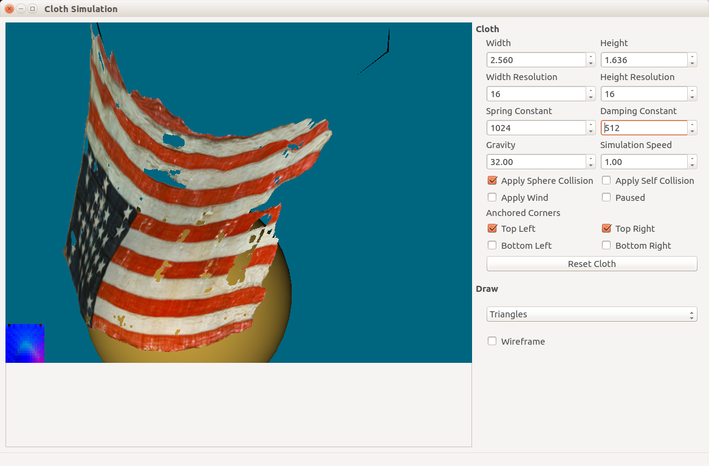

**Cloth Simulation**
================
A simple CPU-based cloth simulation I created using NGL as part of university coursework. Please note that this requires NGL (available [here](https://github.com/NCCA/NGL)) to be installed in your home directory on Linux, and "$HOME/NGL/lib" to be added to your LD_LIBRARY_PATH environment variable if running the program outside of Qt Creator.

The following is copied from my coursework submission:

----------

Summary
-------

This program aims to give a visually plausible simulation of a hanging sheet of cloth using Verlet integration and provide a UI to the user for experimenting with different settings and variables of the simulation. The main window of the program is divided into a viewport where the simulation is displayed and a UI column where the simulation variables and settings can be changed.

----------

Instructions
------------

Dragging with the left mouse button on the viewport will orbit the camera around the origin. Dragging with the right will translate the camera, and the middle mouse button will move the collision sphere around. The texture containing the world-space vertex normals is displayed in the bottom-left corner. Red represents X values, green represents Y and blue Z.
On the right are the UI options: 

-	**Width** and **Height** control the dimensions of the cloth sheet.
-	**Width Resolution** and **Height Resolution** control how many particles are used along those respective axes.
-	**Spring Constant** controls how stiff the springs are.
-	**Damping Constant** controls how quickly the springs will stop oscillating.
-	**Gravity** controls the strength of the gravity acting on the particles.
-	**Simulation Speed** is a multiplier for how fast the simulation runs.
-	**Apply Sphere Collision** sets whether the cloth will collide with the yellow sphere.
-	**Apply Self Collision** sets whether the cloth will collide with itself.
-	**Apply Wind** sets whether a turbulent wind-like force is applied to the cloth sheet.
-	**Paused** sets whether the simulation is in suspended animation.
-	Each of the **Anchored Corners** check-boxes sets whether the respective corner of the sheet is "anchored" i.e. the cloth will hang from that point.
-	The **Reset Cloth** button will set the cloth back to its initial position using the current options. This is useful if the cloth "explodes" due to the variable values crossing a certain threshold and exponentially increasing the energy in the system.

----------

Method
------

The simulation uses the mass-spring system, a commmon technique used for cloth. In this system the cloth is represented by a grid of particles (masses) connected by springs which obey Hooke's law. 
In my implementation, at first I represented these components with a Spring and Particle class with public attributes, but later replaced these with struct equivalents so their attributes could be accessed with a memory address and an offset. The particles would obey Newton's second law of motion, and since each particle would be connected to multiple springs as well as being affected by gravity, the forces acting on it would need to be summed up first before their next position was calculated. This was achieved fairly easily with two loops: once iterating through the springs to add the forces they exert on the particles to the particles' "pending force" attributes, and once through the particles themselves to add forces such as gravity and air resistance before updating their positions.

Another feature was Verlet integration; rather than simple Euler integration which stores position and velocity values, Verlet uses a position and a previous position. As well as still being fairly fast, the velocity interpreted from these values never becomes "out of sync" with the position, resulting in much better energy conservation in physics calculations. 

I decided that the simulation on the CPU would run the physics calculations and send the particle positions (interpreted as vertex positions) to the GPU, which would calculate the normals, texture co-ordinates and everything else needed to display the cloth on the screen. This presented a number of interesting problems.
Firstly, to calculate the vertex normals, the GPU thread for each vertex would need to know the positions of neighbouring vertices as well as its own. I realised that the simple rectangular shape of the cloth sheet would allow me to pass in the vertex positions as a uniform texture so each vertex could access any other vertex position. I was using GLSL's texelFetch() function to access them without interpolation, which required a single integer index into the texture. This was stored as a float so it could exist in the same buffer as the positions. It was then converted to an integer in the vertex shader, which was less than ideal but worked well enough.
The next problem was that the vertex threads on the GPU needed to be spawned in the first place; in the end I simply used a VAO and its draw function which I had retained from an earlier implementation. The downside to this, of course, was the inefficiency of OpenGL now having two different representations of the same data. 
Furthermore, I wanted to be able to point OpenGL to the same contiguous particle/vertex data that the CPU was manipulating to minimise copying - this was why I made the particles as structs with all float data and not classes. This worked fine for reading vertex attribute data into the VAO since it could simply skip past the particle data it did not need (e.g. mass). However, the texture required it to be tightly packed, so a correctly-formatted copy of the data was needed anyway, defeating the point of the sharing somewhat.
Next, since the normals were not stored as a vertex attribute, they would be calculated at least twice for each particle since at least two triangles met at each particle position. I had already considered this and planned to write out the normals to another uniform texture by calculating them in a separate shader, activating a framebuffer texture and rendering the normals to that. I very nearly had this working (as should be evident from the texture in the bottom left of the viewport) but despite numerous attempts I could not get the shader to receive the correct data. In the end I skipped this extra render pass and sent the position texture straight to the final "Texture" shader and calculated the normals there.

Overall I learned a lot about OpenGL's API during the course of this project. Were I to go back and redesign my program I would definitely give more thought to the "flow" of the data so that the physics and graphics systems would co-operate more efficiently, perhaps by offloading the whole simulation on to the GPU. As well as this, I would have better integration between the cloth and the UI, as many functions simply pass data unmodified through the layers of abstraction between them.
